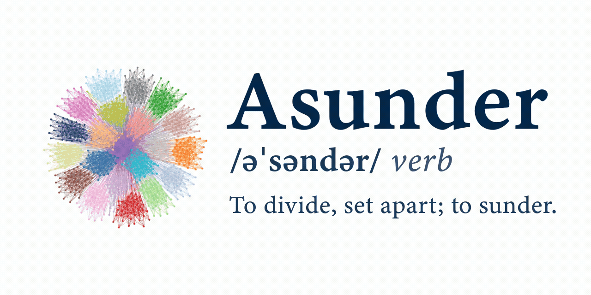

---
Asunder is a Python package for constrained network structure detection (graph clustering) on undirected graphs, with workflows centered on column generation and customizable master/subproblem pipelines. In said workflows, expensive Integer Linear Program (ILP) subproblems are replaced with heuristic clustering algorithms while ensuring that dual information from the master problem are respected. This enables the solution of a wide range of constrained structure detection (graph clustering) problems, insofar as a master problem, and any other relevant custom element, can be properly formulated. See [problem fit section](#problem-fit) for more detail.

Development of Asunder is led by [Andrew Allman's Process Systems Research Team](https://allmanaa.engin.umich.edu/) at the University of Michigan.

## Install

Base install:

```bash
pip install put-asunder
```

Optional extras:

```bash
pip install "put-asunder[graph,viz]"
```

Legacy heuristics (best-effort on Python 3.13):

```bash
pip install "put-asunder[legacy]"
```

## Python Support

- Guaranteed: Python 3.10, 3.11, 3.12, 3.13 for core package.
- Guaranteed: mainstream extras (`graph`, `viz`) on Python 3.10–3.13.
- Best-effort: `legacy` extra on Python 3.13.

## Quickstart

```python
import numpy as np
from asunder import CSDDecomposition, CSDDecompositionConfig

# graph adjacency
A = np.array([
    [0, 1, 1, 0, 0, 0, 0, 0, 0, 0, 0, 0, 0],
    [1, 0, 1, 0, 0, 0, 0, 0, 0, 0, 0, 0, 0],
    [1, 1, 0, 0, 0, 0, 0, 0, 0, 0, 0, 0, 1],
    [0, 0, 0, 0, 1, 1, 0, 0, 0, 0, 0, 0, 1],
    [0, 0, 0, 1, 0, 1, 0, 0, 0, 0, 0, 0, 0],
    [0, 0, 0, 1, 1, 0, 0, 0, 0, 0, 0, 0, 0],
    [0, 0, 0, 0, 0, 0, 0, 1, 1, 0, 0, 0, 1],
    [0, 0, 0, 0, 0, 0, 1, 0, 1, 0, 0, 0, 0],
    [0, 0, 0, 0, 0, 0, 1, 1, 0, 0, 0, 0, 0],
    [0, 0, 0, 0, 0, 0, 0, 0, 0, 0, 1, 1, 0],
    [0, 0, 0, 0, 0, 0, 0, 0, 0, 1, 0, 1, 0],
    [0, 0, 0, 0, 0, 0, 0, 0, 0, 1, 1, 0, 1],
    [0, 0, 1, 1, 0, 0, 1, 0, 0, 0, 0, 1, 0]
], dtype=float)

# ifc_params contains function and parameters for generating initial feasible partition(s) 
cfg = CSDDecompositionConfig(
    ifc_params={"generator": lambda N, **_: [np.ones((N, N))], "num": 1, "args": {"N": A.shape[0]}},
    extract_dual=False,
    final_master_solve=False,
)

result = CSDDecomposition(config=cfg).run(A)
print(result.metadata)
```

## Solver Setup

Asunder accepts user-provided solver objects. For Gurobi, `GRB_LICENSE_FILE` is used by your environment. Example:

```python
from asunder import create_solver

solver = create_solver("gurobi_direct")
```

## Problem Fit

Asunder supports general constrained partitioning when requirements can be expressed as must-link and cannot-link constraints.

Asunder also works well out of the box for optimization problems where coordination or operations are coupled across space (e.g. central coupling) and/or time and those interactions can be represented as a graph over constraints.

Sample fit signals:
- a useful interpretation of must-link/cannot-link or worthy-edge constraints
- coupling across time periods, units, or resources
- mixed discrete-continuous structure with meaningful constraint interactions
- value from multilevel partitioning or core-periphery structure detection

Some representative domains:
- stochastic design and dispatch in energy systems
- scheduling and resource allocation in healthcare systems
- planning, routing, and location in supply chain and logistics
- network configuration and resource management in telecommunications

For a fuller guide on where default workflows are sufficient vs where customization helps, see `docs/problem_fit.rst`.

## Customization Points

For custom problems, typical extension points are:

1. Initial feasible partition generator.
2. `solve_master_problem` replacement.
3. Optional heuristic or ILP subproblem replacement.
4. Optional partition refinement stage.

## Constraint Graph Compatibility

For the built-in case-study evaluation workflows (`run_evaluation`), Asunder expects a constraint-graph pattern consistent with the provided case studies.

Required structure for `run_evaluation`-style workflows:

- undirected graph (typically `networkx.Graph`)
- node attribute `constraint` (string tag used for ground-truth and role grouping)
- edge attribute `var_type` with values `"integer"` or `"continuous"`

Commonly present (recommended) attributes:

- node attribute `type` (for example `"constraint"`)
- node attribute `details` (metadata dict)
- edge attributes `weight`, `variables`, `var_types`

How these are used:

- `constraint` identifies core/nonlinear tags in built-in case studies
- `var_type` determines candidate edge sets for CP and CD_Refine paths

If you are not using `run_evaluation` and instead calling decomposition APIs directly, you can work from an adjacency matrix plus explicit `must_link`, `cannot_link`, and optional `worthy_edges`.

## Examples

- Nonlinear B&P-style decomposition: `examples/nonlinear_bp.py`
- Custom subproblem wiring: `examples/custom_subproblem.py`

## Documentation

Sphinx docs are scaffolded in `docs/` and intended for Read the Docs deployment.

## References

Asunder integrates or wraps methods from:

- networkx
- sklearn
- python-igraph / leidenalg
- scikit-network
- signed-louvain style algorithms
