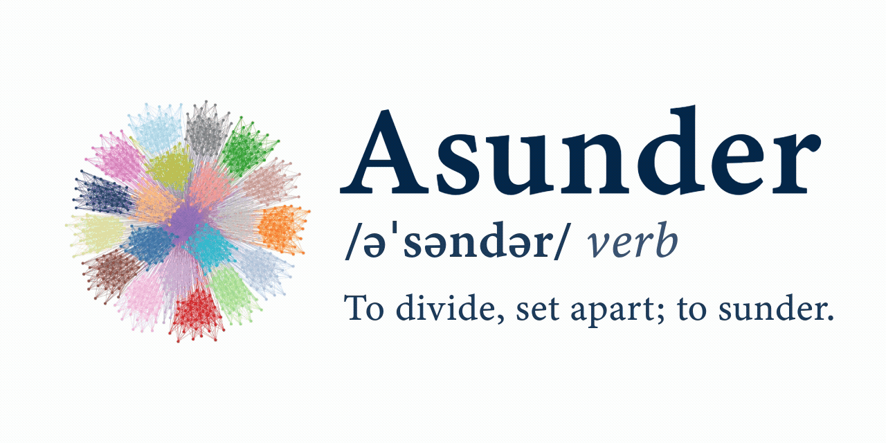

Asunder Documentation
=====================

Asunder is a package for constrained structure detection on undirected graphs. In machine learning terms, this is called constrained graph clustering and in some other communities, constrained graph partitioning.

.. toctree::
   :maxdepth: 2
   :caption: Getting Started

   getting_started/index

.. toctree::
   :maxdepth: 2
   :caption: Learn

   learn/index

.. toctree::
   :maxdepth: 2
   :caption: API

   api/index

.. toctree::
   :maxdepth: 2
   :caption: Reference

   reference/index
